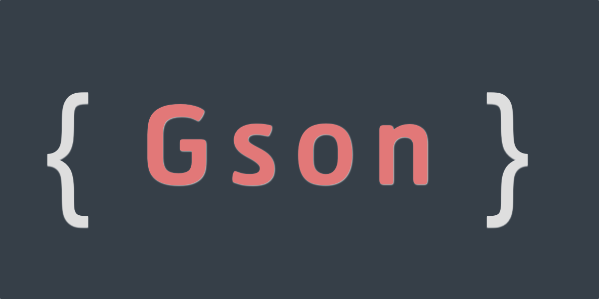
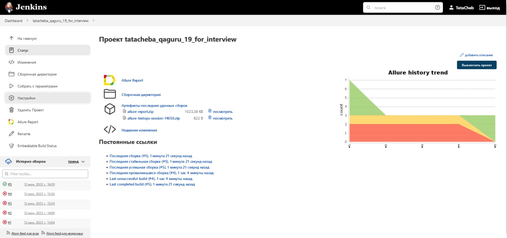
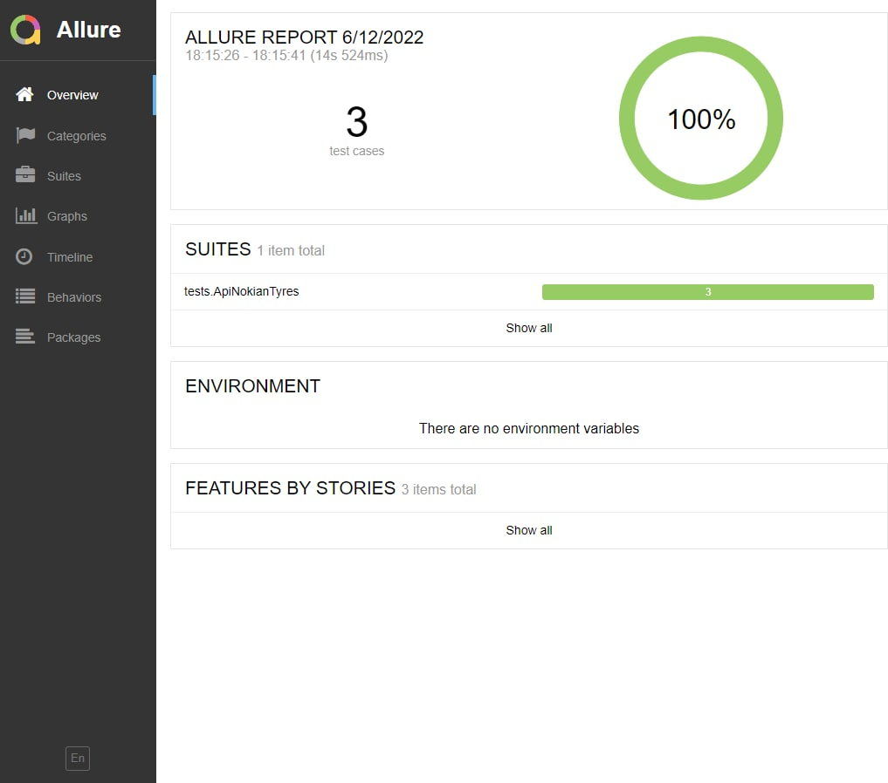
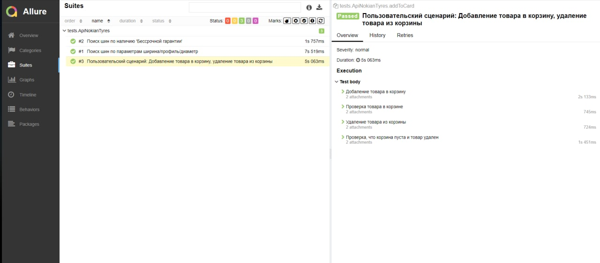
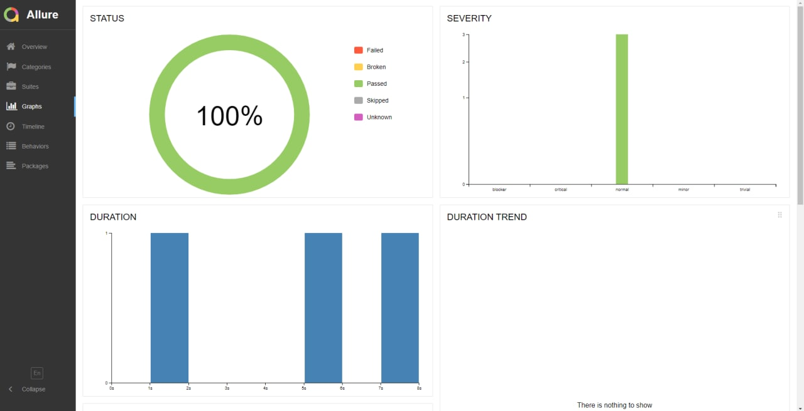
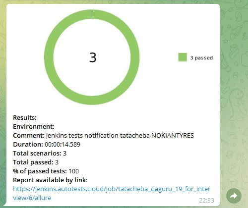

# API-testing project for Nokian tyres

# :arrow_right: [NOKIAN TYRES][id] :arrow_left:

[id]: https://www.nokiantyres.ru/

## :page_with_curl: Contents

> :heavy_check_mark: [Technologies and tools](#technologist)
>
> :heavy_check_mark: [Verified checks](#verified)
>
> :heavy_check_mark: [Run tests from the terminal](#computer)
>
> :heavy_check_mark: [Running Tests in Jenkins](#running_tests)
>
> :heavy_check_mark: [Report on test results in Allure Report](#report_allure_report)
>
> :heavy_check_mark: [Integration with Allure TestOps](#integration_allure_testops)
>
> :heavy_check_mark: [Notifications in Telegram using a bot](#notifications_telegram_bot)

## <a name="technologist"> Technologies and tools</a>

<p align="center">
<a href="https://www.jetbrains.com/idea/"></a>
<a href="https://www.java.com/"></a>
<a href="https://github.com/"></a>
<a href="https://junit.org/junit5/"></a>
<a href="https://gradle.org/"></a>
<a href="https://github.com/allure-framework/allure2"></a>
<a href="https://www.jenkins.io/"></a>
<a href="https://github.com/google/gson"></a>
<a href="https://rest-assured.io/"></a>
<a href="https://telegram.org/"></a>
</p>

## <a name="verified">Verified checks</a>

-   ✓ Search tyres by width/profile/diameter parameters.
-   ✓ Retrieval of tyres under the 'Indefinite Guarantee'".
-   Custom Script:
    -   ✓ Add product to cart.
    -   ✓ Check the shopping cart.
    -   ✓ Removing the product from the cart.
    -   ✓ Check that the cart is empty and the goods have been removed.

## <a name="computer">Run tests from the terminal</a>

Local start:

```bash
gradle clean test
```

## <a name="running_tests">Running Tests in [Jenkins](https://jenkins.autotests.cloud/job/tatacheba_qaguru_11_for_interview)</a>

<p align="center">
  
</p>

## </a> Отчет в <a target="_blank" href="https://jenkins.autotests.cloud/job/tatacheba_qaguru_11_for_interview/allure">Allure report</a>

### Main

<p align="center">

</p>

### Tests

<p align="center">

</p>

### Graphics

<p align="center">

</p>

##  <a name="integration_allure_testops">Integration with [Allure TestOps](https://allure.autotests.cloud/project/1199/)</a>

### Test cases

<p align="center">

</p>

##  <a name="notifications_telegram_bot">Notifications in Telegram using a bot</a>

<p align="center">

</p>
